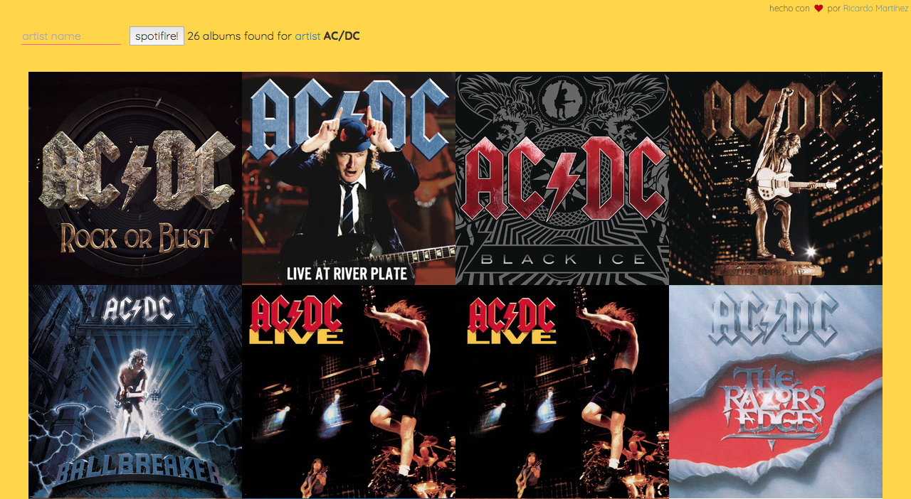
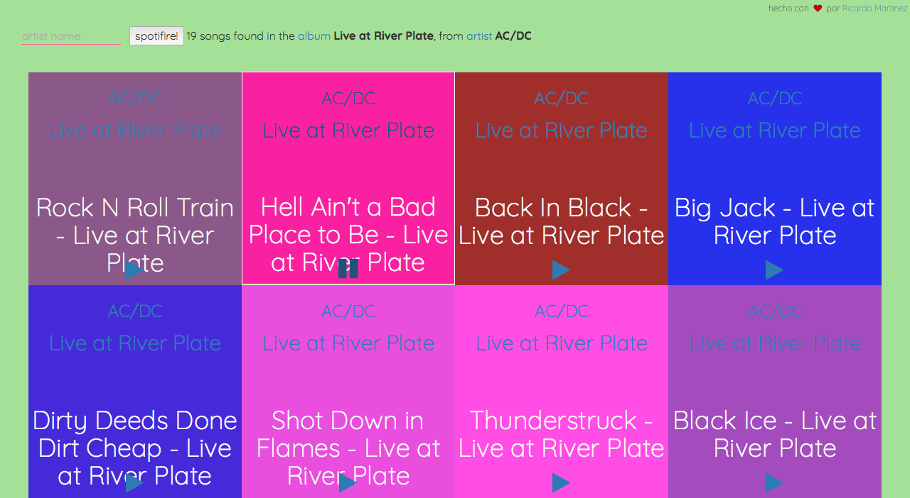

[](http://www.skylabcoders.com/)
<a href="https://www.w3.org/"></a>

## Full Stack Web Development Bootcamp @Otoño2017

### Spotifire website, con JQuery y Ajax.

Otro reproductor basado en el gran _Spotify_, pequeño reto de JQuery y  ajax.

Para obtener un token fresco, me he creado un middleware que hace de proxy para obtener el token de Spotify...

Si no quieres usar esa APi, recuerda que deberás [canviar el valor del **token**](https://developer.spotify.com/web-api/console/get-search-item/) en la variable ```token```, del fichero ```app.js```

Spotify proporciona un token de duración determinada.




